

# Slicer4 րոպե

Սոնյա Պուժոլ, փ.դ.

 

Ռադիոլոգիայի ասիստենտ պրոֆեսոր
Բրիգհեմի և կանանց հիվանդանոց
Հարվարդի բժշկական դպրոց

---

## Slicer. 4 րոպե տևողությամբ ուսուցողական տեսանյութ

Այս ուսուցողական ձեռնարկը 4 րոպե տևողությամբ ներածություն է բժշկական պատկերների վերլուծության համար նախատեսված Slicer5 ծրագրի 3D վիզուալիզացման հնարավորություններին։ 

---

## Slicer5 ծրագրաշար և տվյալների հավաքածու

*Ներբեռնել Slicer5 ծրագրաշարը՝ հասանելի http://download.slicer.org կայքում

*Ներբեռնել Slicer4minute տվյալների հավաքածուն՝ հասանելի https://www.slicer.org/wiki/Documentation/4.10/Training կայքում

---

## 3D Slicer տարբերակ 5

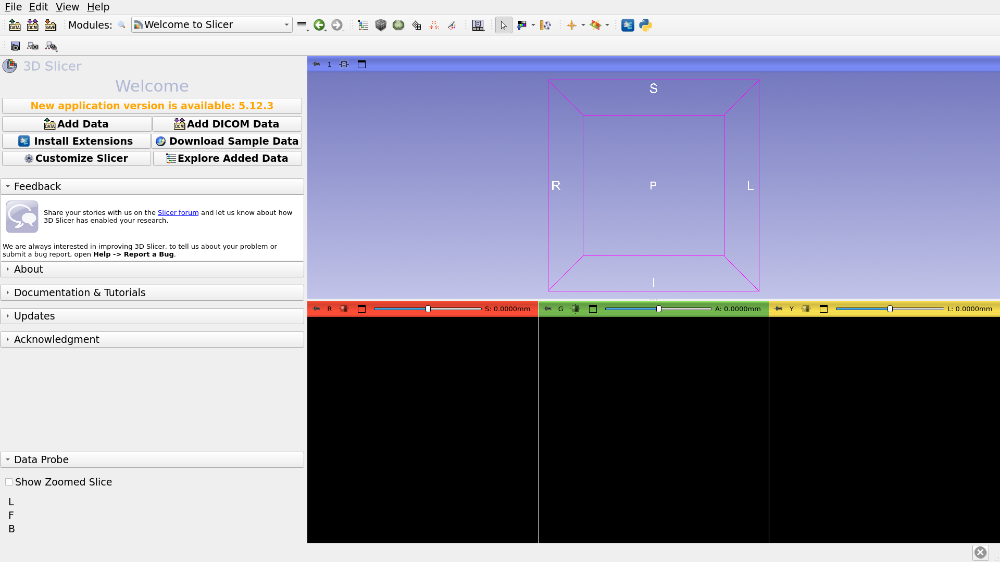

---

## 3D Slicer տեսարան

*Slicer տեսարանը MRML (Medical Reality Modeling Language) ֆայլ է, որը պարունակում է Slicer-ում բեռնված տարրերի ցուցակ (հատորներ, մոդելներ, ֆիդուցիալներ, փոխարկումներ և այլն)

*Հաջորդ օրինակում մենք օգտագործում ենք «Slicer4minute.mrml» տեսարանը, որը բաղկացած է ՄՌՏ սկանից և գլխի 3D մոդելներից. 

*Տեսարանի ֆայլը և տվյալների հավաքածուները պահպանվել են որպես MRB (Medical Reality Bundle) ֆայլ.  

*MRB ֆայլի ֆորմատը Slicer-ի արխիվային ֆայլի ֆորմատն է։

---

## Slicer4minute տվյալների հավաքածուի բեռնում

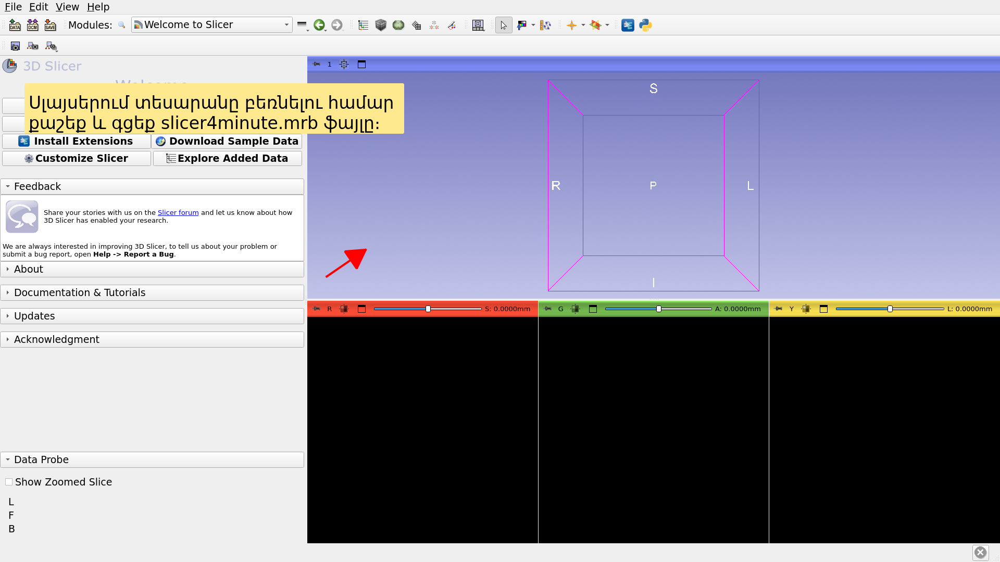

---

## Slicer4րոպե տեսարան

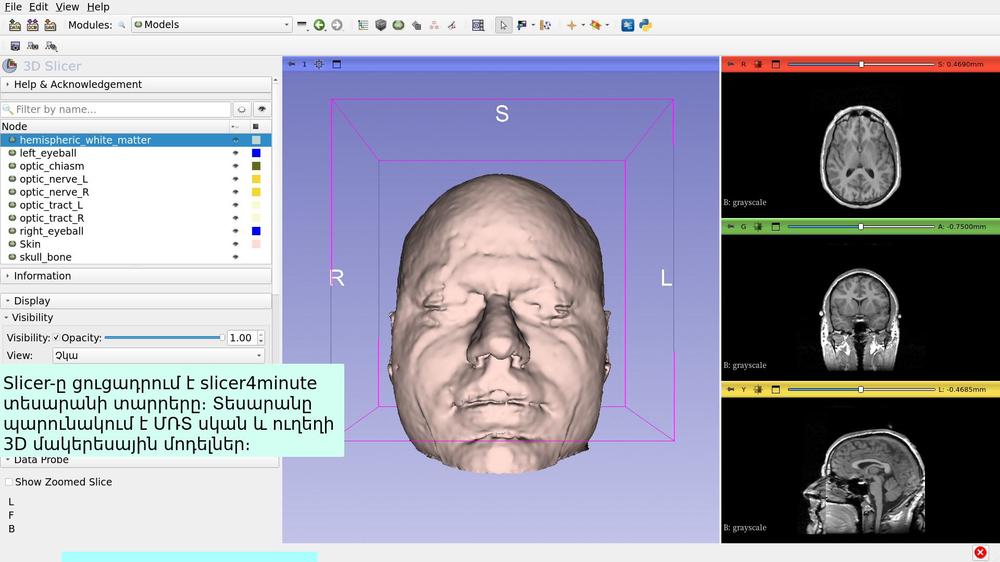

---

## 3D վիզուալիզացիա

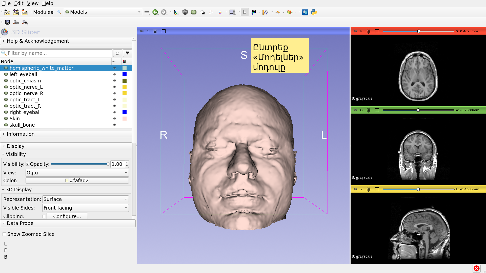

---

## 3D վիզուալիզացիա

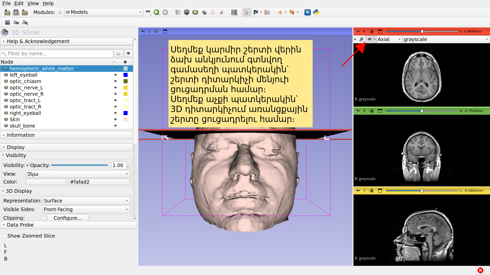

---

## 3D վիզուալիզացիա

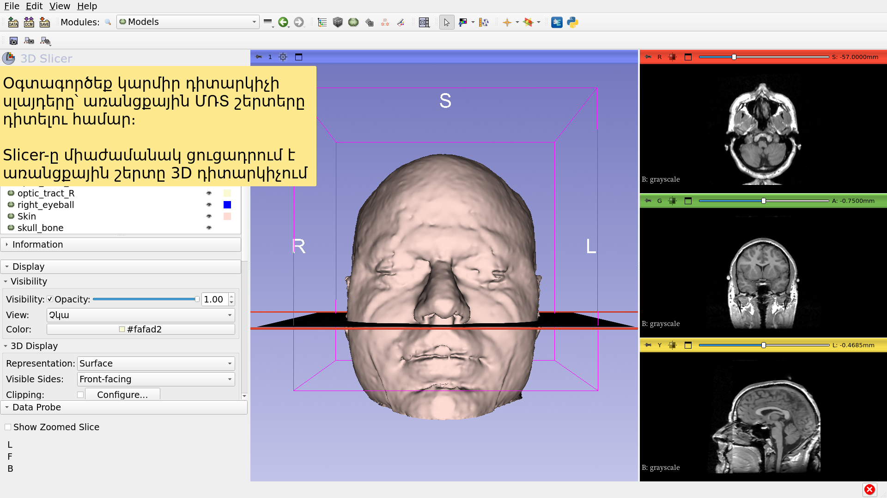

---

## 3D վիզուալիզացիա

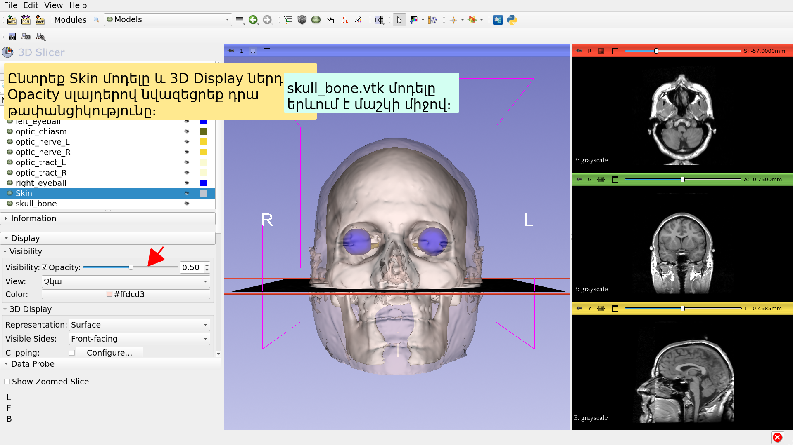

---

## 3D վիզուալիզացիա

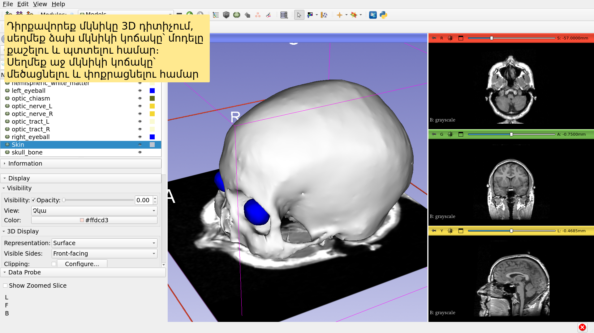

---

## Անատոմիական տեսանկյուններ

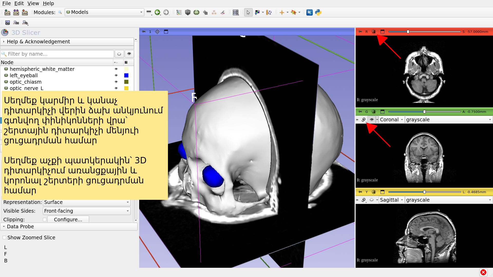

---

## 3D վիզուալիզացիա

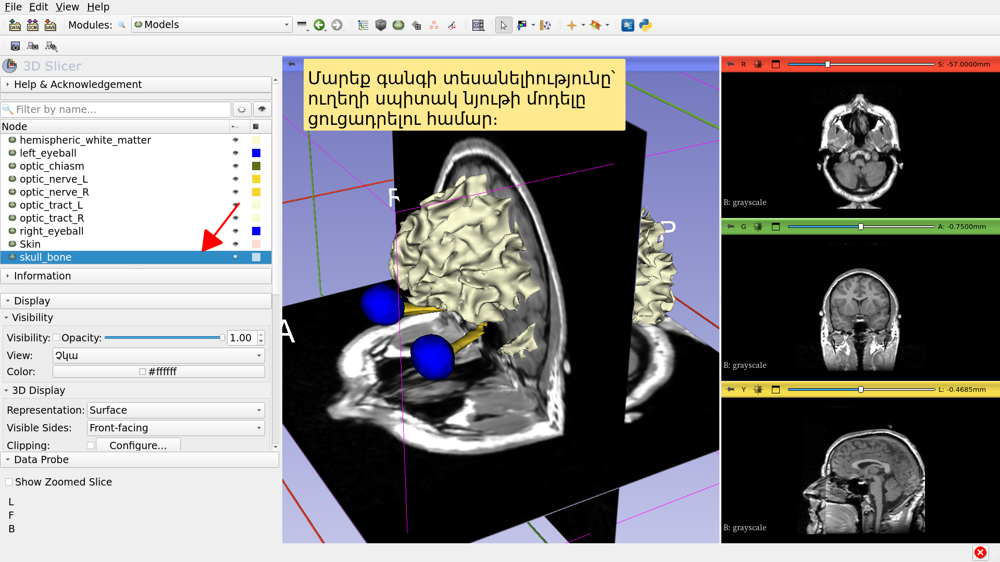

---

## 3D վիզուալիզացիա

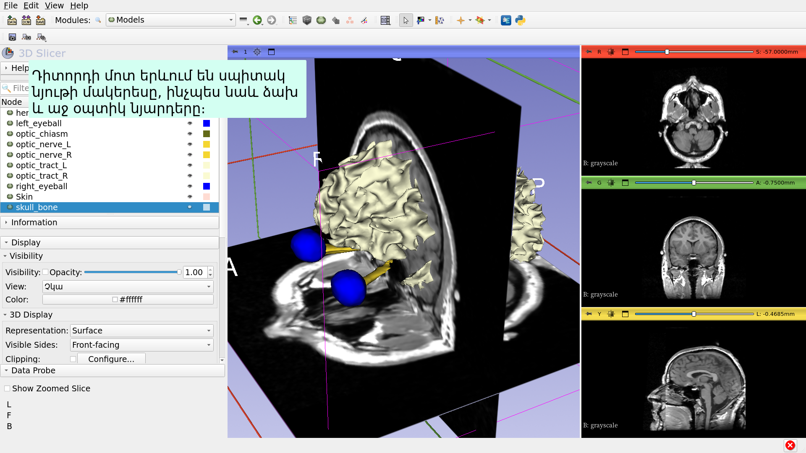

---

## 3D վիզուալիզացիա

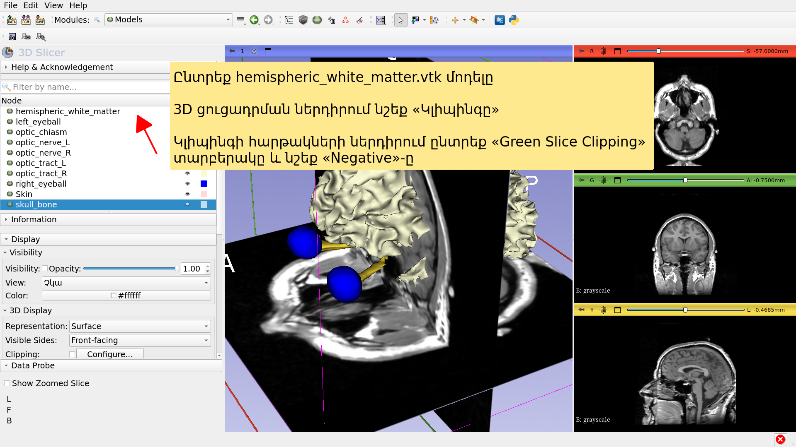

---

## Slicer. 4 րոպե տևողությամբ ուսուցողական տեսանյութ

*Այս ձեռնարկը կարճ ներածություն էր Slicer-ում ՄՌՏ տվյալների և 3D մոդելների ինտերակտիվ 3D վիզուալիզացիայի վերաբերյալ։

*Slicer5-ի ուսուցողական ժողովածուն պարունակում է մի շարք ձեռնարկներ և նախահաշվարկված տվյալների հավաքածուներ՝ ծրագրաշարը օգտագործել սովորելու համար։

---

# Շնորհակալագրեր

Բժշկական պատկերների հաշվարկման ազգային դաշինք

NIH U54EB005149

Նյարդապատկերային վերլուծության կենտրոն

NIH P41EB015902

---
