

# AI-based Segmentation in 3D Slicer

Սոնյա Պուջոլ, Ph.D.
Բրիգհեմ և կանանց հիվանդանոց,
Հարվարդի բժշկական դպրոց
Բոստոն, Մասաչուսեթս

 

Slicer Ribeirão Preto աշխատաժողով
30 հունիս 2025 թ.

---

## Ձեռքով ընդդեմ արհեստական բանականության վրա հիմնված սեգմենտացիա

Բժշկական պատկերները ավանդաբար ձեռքով են սեգմենտացվել, ինչը ժամանակատար գործընթաց է, պահանջում է ռադիոլոգների ինտենսիվ ջանքեր և ենթակա է ընթերցողների միջև փոփոխականության։

---

## Ձեռքով ընդդեմ արհեստական բանականության վրա հիմնված սեգմենտացիա

Վերջին տասնամյակում պատկերների սեգմենտացիան զարգացել է խորը ուսուցման ալգորիթմների (օրինակ՝ nnUnet, Գերմանիայի քաղցկեղի հետազոտական կենտրոն (DKFZ)/Հելմհոլցի հետազոտական ինստիտուտ) զարգացման շնորհիվ։

AI-ով աշխատող սեգմենտացիոն գործիքները կարող են կրճատել սեգմենտացիայի ժամանակը և ապահովել ավելի վերարտադրվող արդյունքներ։

---

## ՀԱ տերմինաբանություն

Մոդելը արհեստական բանականության ալգորիթմ է, որը ուսուցվել է կոնկրետ առաջադրանք կատարելու համար (օրինակ՝ ուղեղի ուռուցքի սեգմենտացիայի մոդել)։

Արհեստական բանականության մոդելի կշիռները փոքր թվեր են, որոնք որոշում են, թե որքան կարևորություն է մոդելը տալիս պատկերի տարբեր առանձնահատկություններին։

Ուսուցման փուլում մոդելը սովորում է փորձագետների կողմից պիտակավորված տվյալներից օրինաչափություններ և հարմարեցնում է իր կշռերը կանխատեսումները բարելավելու համար։

Վավերացման/թեստավորման փուլում մոդելը գնահատվում է տվյալների առանձին հավաքածուի վրա, որը չի օգտագործվել ուսուցման փուլում։

Եզրակացության (Inference) փուլում մոդելը կիրառվում է նոր տվյալների հավաքածուների վրա՝ կատարելու այն հատուկ առաջադրանքը, որի համար այն ուսուցվել է։

---

## 3D Slicer AI-ի ուսուցողական ձեռնարկ

Այս ձեռնարկը կենտրոնացած է տարբեր նախապես ուսուցված արհեստական բանականության մոդելների օգտագործմամբ եզրակացության առաջադրանքների իրականացման վրա՝ անատոմիական և պաթոլոգիական կառուցվածքների ավտոմատ սեգմենտացման համար։

---

## MONAIAuto3DSeg Slicer ընդլայնում

Այս ուսուցողական ձեռնարկը օգտագործում է MONAIAuto3DSeg Slicer ընդլայնման նախապատրաստված մոդելները։

Գործիքը նախատեսված է աշխատելու նոութբուքերում կամ միջին հզորության աշխատասեղանի համակարգիչներում առանց GPU-ի։

---

## MONAIAuto3DSeg Slicer ընդլայնում

Մի քանի մոդալությունների աջակցություն (ԿՏ, ՄՌՏ):

Մի քանի անատոմիական հատվածներ (գլուխ, կրծքավանդակ, որովայն, կոնք և այլն):

Մի քանի պաթոլոգիաներ (ուռուցք, արյունահոսություն, այտուց):

---

## Slicer AI-ի ուսուցում. Սեգմենտացիոն առաջադրանքներ

Սեգմենտացիայի առաջադրանք #1: Պրոստատա

Սեգմենտացիայի առաջադրանք #2: Գլխուղեղի գլիոմա

Սեգմենտացիայի առաջադրանք #3: Ամբողջ մարմնի սեգմենտացիա

---

# Բացարձակ արհեստական բաժանման առաջադրանք #1: Պրոստատ

---

##  

Պրոստատի պերիֆերիական գոտու (PZ) և անցումային գոտու (TZ) արհեստական բանականության վրա հիմնված սեգմենտացիա T2-քաշված ՄՌՏ պատկերներում։

Տվյալների հավաքածու:

msd_prostate_01-t2

msd_prostate_01-adc

---

## 

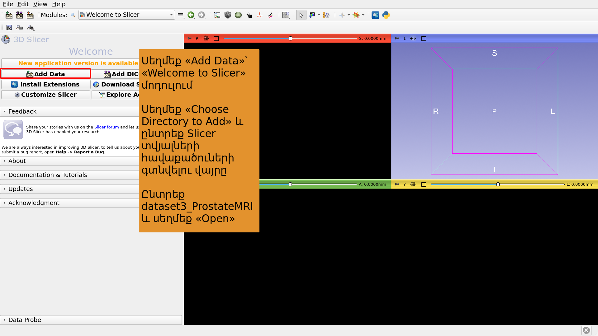

---

## 

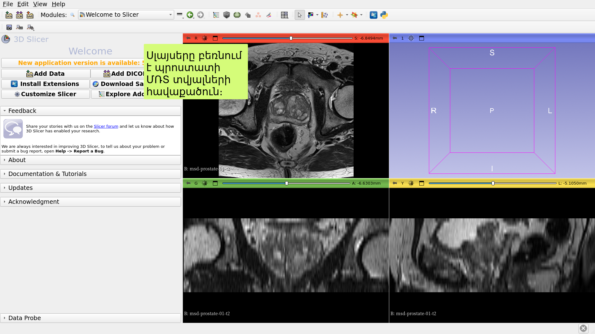

---

## 

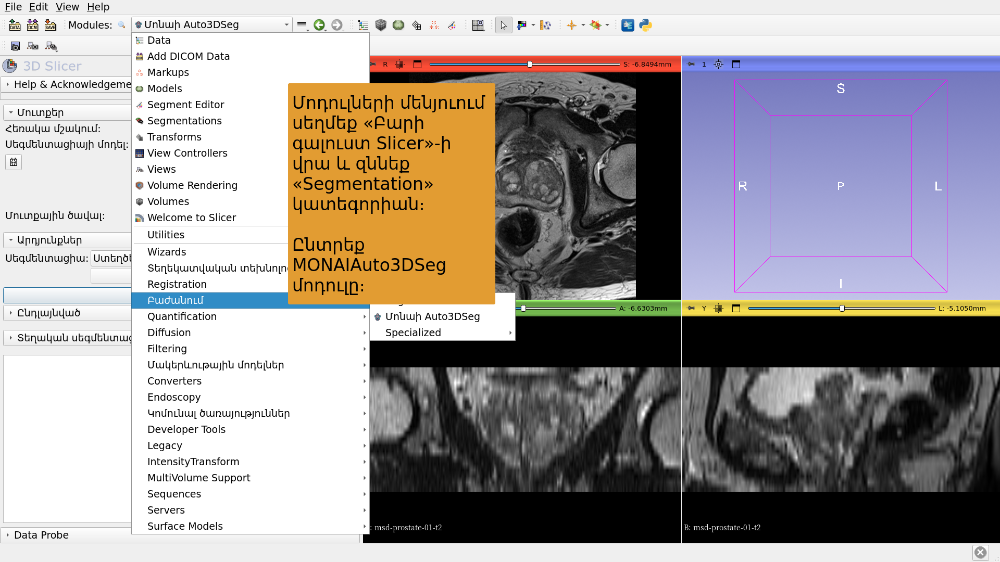

---

## 

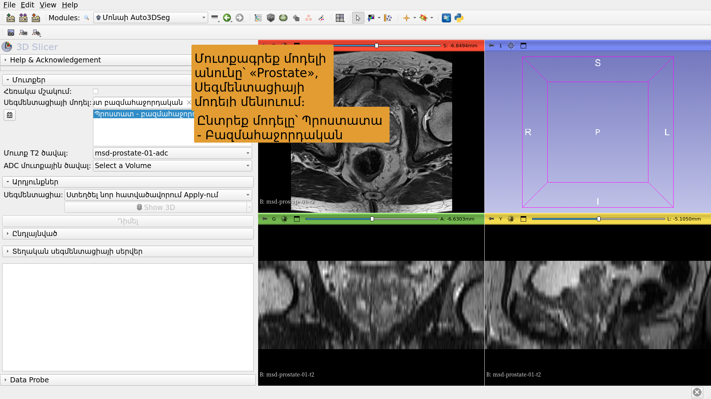

---

## 

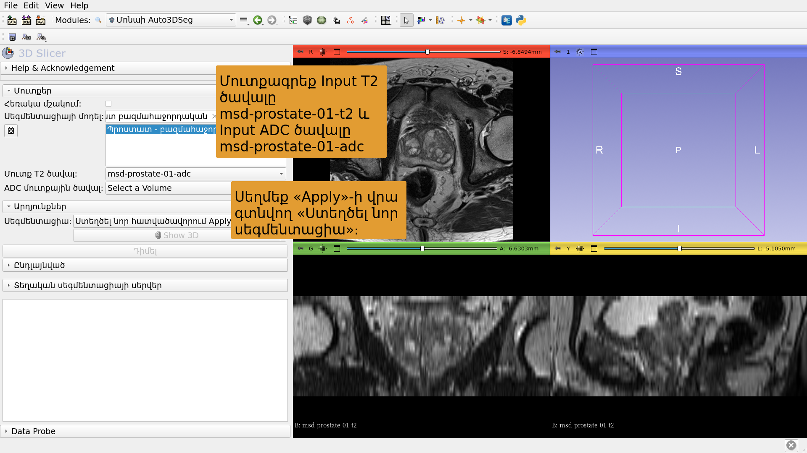

---

## 

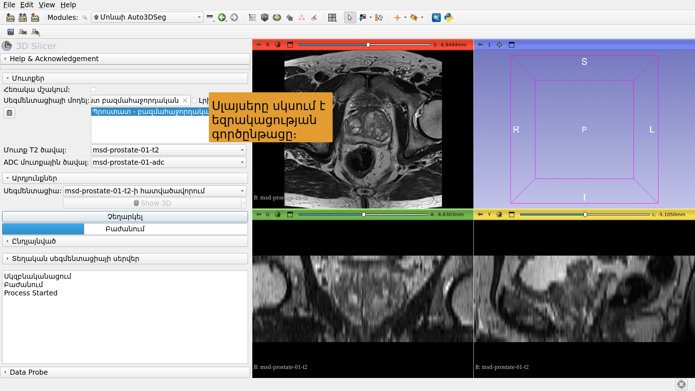

---

## 

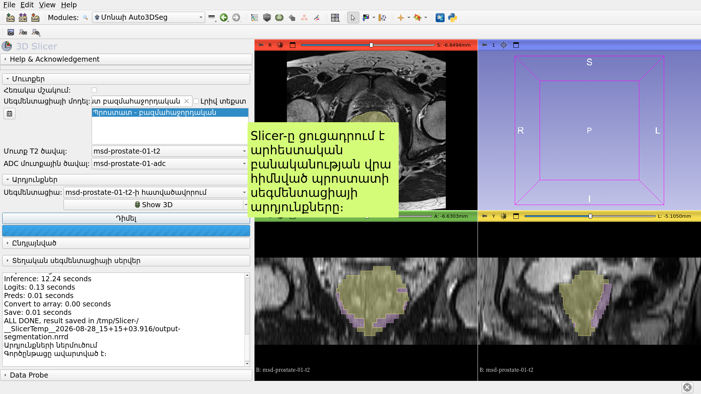

---

# Բացարձակ արհեստական բանականության սեգմենտացիայի առաջադրանք #2՝ ուղեղի գլիոմա

---

##  

Նեյրոնային ցանցի վրա հիմնված նորագոյացության, նեկրոզի և այտուցի հատվածավորում ուղեղի ՄՌՏ պատկերներում։

Տվյալների հավաքածուներ:

1) BraTS-GLI_00005-000-t1n (T1-քաշված)

2) BraTS-GLI_00005-000-t1c (T1-քաշված՝ Gd-ից հետո)

3) BraTS-GLI_00005-000-t2w (T2-քաշված)

4) BraTS-GLI_00005-000-t2f (T2-FLAIR)

---

## 

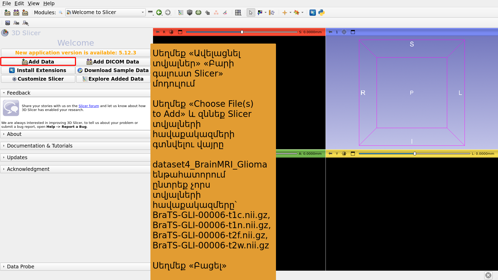

---

## 

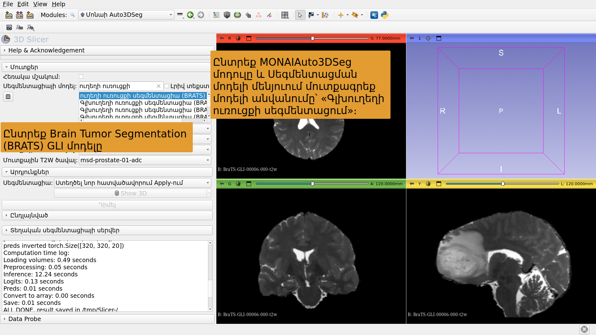

---

## 

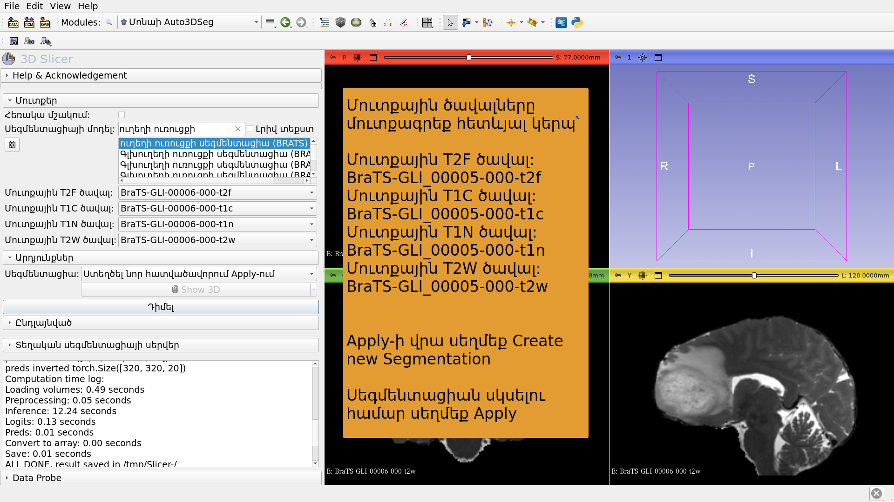

---

## 

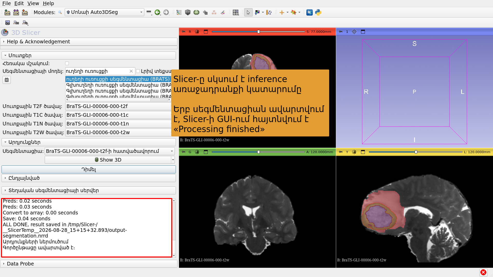

---

## 

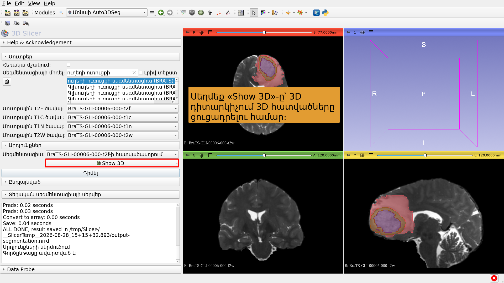

---

# Բացարձակ հատվածավորման առաջադրանք #3: Ամբողջ մարմնի հատվածավորում

---

##  

Ամբողջ մարմնի արհեստական բանականության վրա հիմնված սեգմենտացիա։

Տվյալների հավաքածու:

CT_ThoraxAbdomen

---

## 

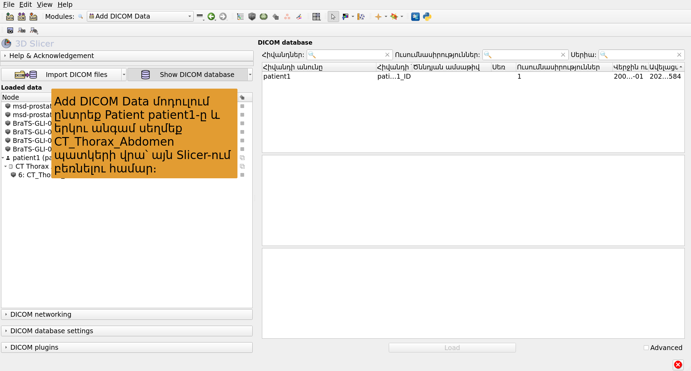

---

## 

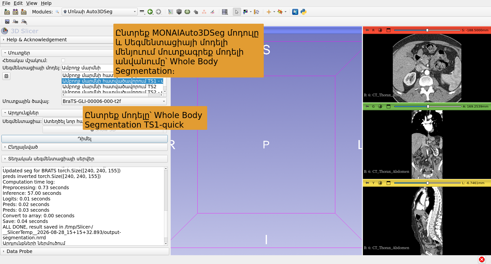

---

## 

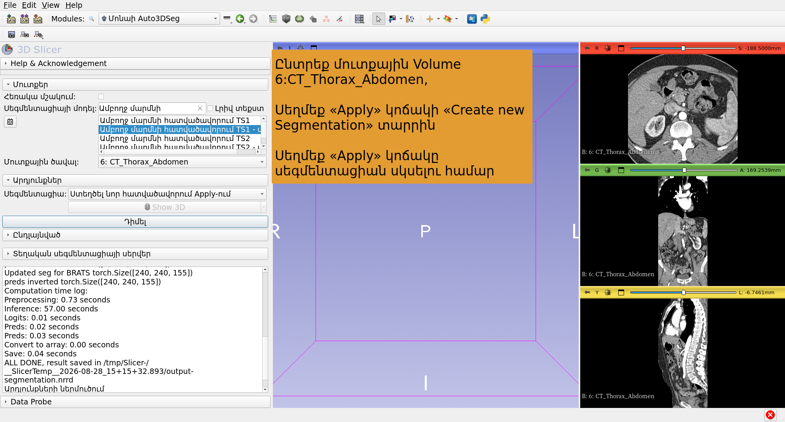

---

## 

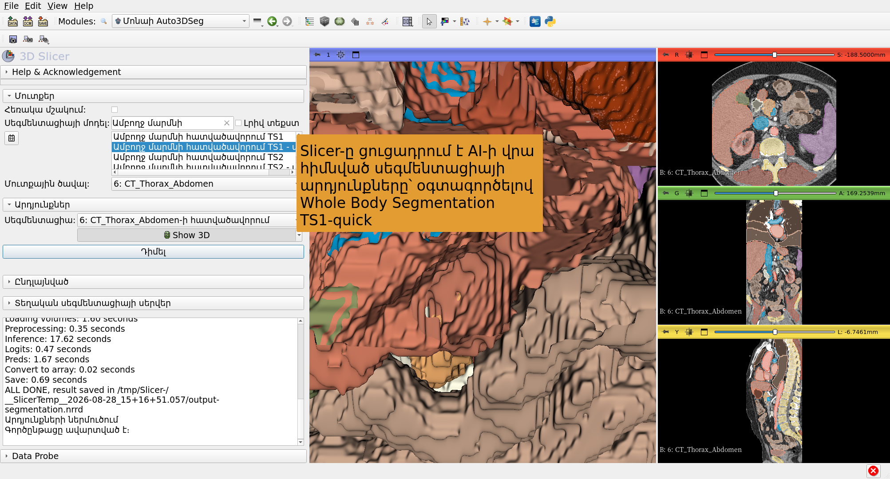

---

## Եզրափակում

3D Slicer MONAIAuto3DSeg ընդլայնումը ապահովում է անատոմիական և պաթոլոգիական կառուցվածքների արագ, արհեստական բանականության վրա հիմնված սեգմենտացիա։

Մոդուլը կարող է աշխատել ստանդարտ նոութբուքներում և դեսքթոփ համակարգիչներում առանց GPU-ի։

---

# Շնորհակալագրեր

3D Slicer-ի միջազգայնացման նախագիծը և 3D Slicer-ի Լատինական Ամերիկայի նախագիծը հնարավոր դարձան Չան Ցուկերբերգի նախաձեռնության ֆինանսավորման շնորհիվ։

---
